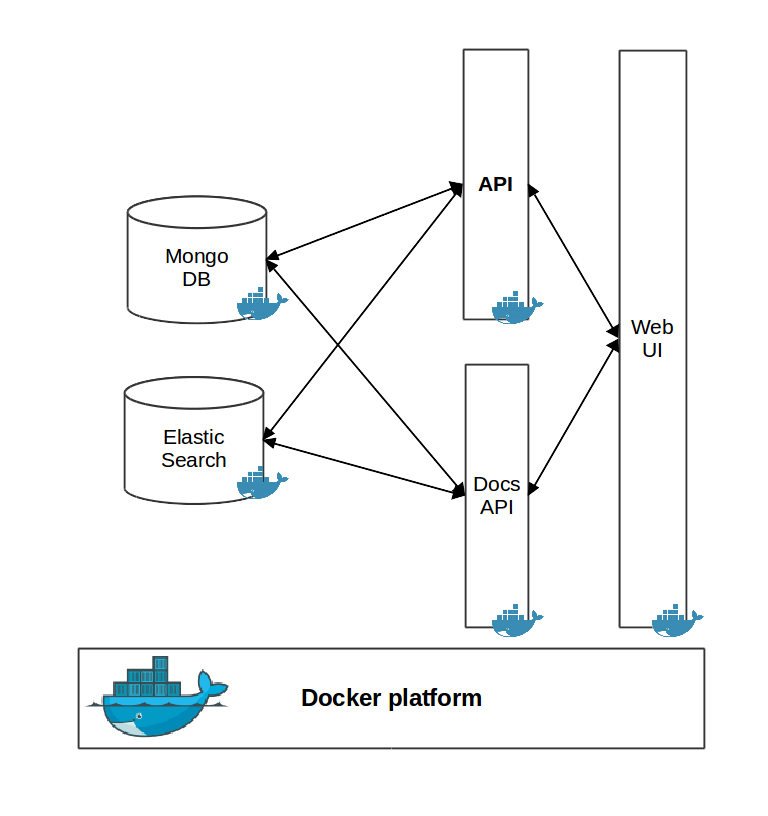

# extra-ext
API implementation, User Interface, and more modules of the IPTC EXTRA project.

## Description
EXTRA platform is built upon a set of services, deployed and running inside [Docker](https://www.docker.com/) containers. More specifically, the services of the platform are the following ones:

* [mongodb](https://www.mongodb.com/) - MongoDB is an open-source, document database that is used to store rules, schemas, dictionaries, taxonomies and topics. Access to MongoDB is not allowed directly outside Docker. To access the stored objects, the API methods must be used.
* [elasticsearch](https://www.elastic.co/products/elasticsearch) - Elastic search used for the indexing of documents and rules. Indexed document are used for testing of rules during their development. Rules are indexed into Percolate index of Elastic Search to be used for document classification.
* [documents-api](https://github.com/iptc/extra-ext/tree/master/documents-api) - An API for documents indexed in ElasticSearch, built using [Python Flask](http://flask.pocoo.org/) library.
* [api](https://github.com/iptc/extra-ext/tree/master/api) - EXTRA API built using [Jersey framework](https://jersey.github.io/). That API exposes the main functionality of EXTRA, including management of rules, schemas, taxonomies and topics (create, update, delete), and also document retrieval and tagging. A description of the API in RAML can be found in [this link](api/extra-api.raml).
* [ui](https://github.com/iptc/extra-ext/tree/master/ui) - A, HTML web interface on top of Apache web server. Uses the previous two APIs to expose the main functionality of EXTRA platform in a user friendly way. Consists of pages for rule writing and testing, management of taxonomies and schemas, document searching and document tagging.

The architecture of EXTRA platform is depicted in the following figure. To make deployment easier, the platform is described in a [docker-compose file](https://github.com/iptc/extra-ext/blob/master/docker-compose.yaml).




## Configuration

To configure the platform for development, [docker-compose file] (https://github.com/iptc/extra-ext/blob/master/docker-compose.yaml) must be edited.

There are three points need to be revised to be able to deploy EXTRA platform.

### MongoDB


First off all, you have to specify data volume of mongodb to ensure data persistence. The directory /data/db inside the container that runs mongodb has to be mounted in a directory on the host machine's local filesystem. To define the local directory change `<path to local mongodb data directory>` in the below section.

```yaml
mongodb:
    image: mongo:3.2.11
    volumes:
        - <path to local mongodb data directory>:/data/db
```

### Elastic Search

In the same way the directory to which elastic search keeps its indexes has to be specified:

```yaml
elasticsearch:
    image: docker.elastic.co/elasticsearch/elasticsearch:5.2.0
    ports:
      - 9200:9200
      - 9300:9300
    volumes:
      - <path to local elasticsearch data directory>:/usr/share/elasticsearch/data
```

Make sure that user that executes the docker images has r/w rights to the elastic search data directory. The easiest way is to give full access:

```sh
$chmod 777 -R <path to local elasticsearch data directory>
```
**important** The *vm_max_map_count* kernel setting needs to be set to at least *262144* for production use.
To apply the setting on a live system type: `sysctl -w vm.max_map_count=262144`

By default, the services allocate and expose the following default ports:
* **elastic search:**  *9200*, *9300* -> *9200*, *9300*
* **documents-api:** *5000* -> *5000*
* **api:** *8888* -> *8888*
* **ui:** *80* -> *80*

To change the default ports, edit the corresponding section in docker-compose.yaml file. For example to change the
port *8888* used by EXTRA API to another port, e.g. *9999*, edit the file as follows:

```yaml
api:
    ports:
      - 9999:8888
```


## Deployment

To start EXTRA platform:

```sh
$ cd extra
$ docker-compose up -d
```

This will create or download images and pull in the necessary dependencies for each service. Once done, it runs the Docker and map the ports to whatever is specified in the [docker-compose.yml](https://github.com/iptc/extra-ext/blob/master/docker-compose.yaml) file.

Verify the deployment by typing:

```sh
$ docker ps
```
There should be 5 running containers.

To stop the running platform:

```sh
$ cd extra
$ docker-compose down
```

## Contact for further details about the project

Manos Schinas (manosetro@iti.gr), Symeon Papadopoulos (papadop@iti.gr)

## See the other repositories of the IPTC EXTRA project:

* [extra-core](https://github.com/iptc/extra-core) - Core implementation of EXTRA
* [extra-rules](https://github.com/iptc/extra-rules) - Two sets of rules developed by EXTRA project
